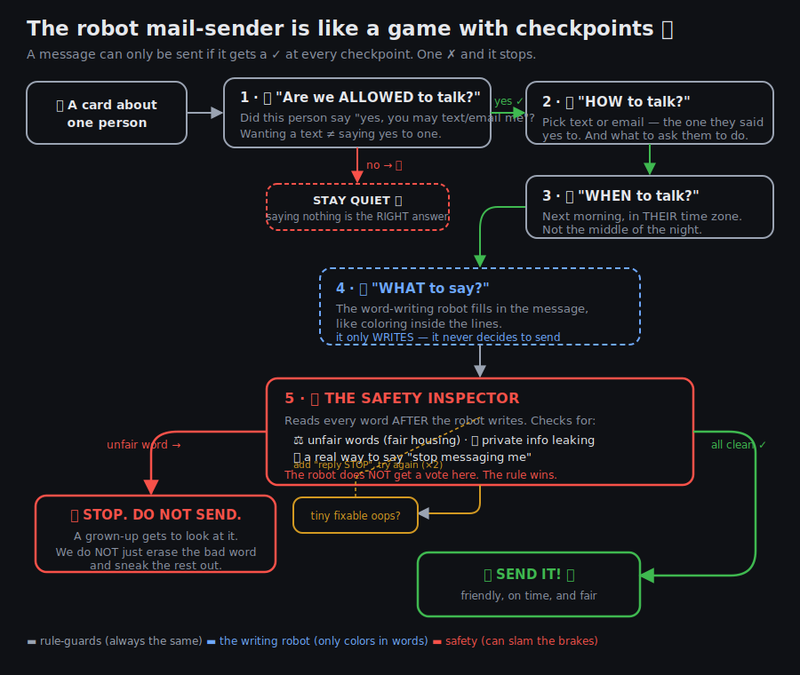

# How this works — explained like you're 5 🧸

Imagine a **robot that sends mail** for an apartment building. Before any message
goes out, it plays a little game with checkpoints — and it only wins if it gets a
✓ at **every single one**. One ✗ and the message stops.

## The checkpoints

**1 · "Am I allowed to talk to this person?" 🚪**
The person's card says which ways they said *yes* to — maybe "yes to email, no to
texts." The robot may only use a way they said yes to. Here's the sneaky part:
*wanting* a text and *saying yes* to a text are different things. A card can say "I
like texts best" but still say "no texts allowed" — and the robot must obey the
**no**, not the *like*. If there's no allowed way to reach them at all, the robot
**stays quiet**, and staying quiet is the *right* answer, not a mistake.

**2 · "How do I talk?" 📮** Pick the allowed way (text or email) and figure out what
to ask them to do (like "come see the apartment").

**3 · "When do I talk?" ⏰** Send it tomorrow *morning*, in **their** timezone —
never in the middle of their night.

**4 · "What do I actually say?" 🖍️** *Now* a word-writing robot fills in the message,
like coloring inside lines someone else drew. Important: this robot **only writes
words**. It never decides whether to send. That's on purpose.

## How it handles the rules — especially fair housing ⚖️

This is the most important part.

The word-writing robot learned to write by reading millions of old apartment ads.
A lot of those ads had **unfair words** in them — like *"perfect for young
professionals,"* *"safe neighborhood,"* or *"great family building."* Those sound
nice, but they're against the law (the **Fair Housing Act**), because they hint that
only *certain kinds of people* are wanted. The law cares about the **sentence
itself** — writing it down is the problem, even if nobody is ever turned away.

So here's the trick: **you can't just ask the robot nicely to be fair.** It learned
those phrases too deeply — sooner or later it writes one by accident. Asking it to be
careful is like asking a puppy to guard a cookie. 🍪

That's why there's a **Safety Inspector (Checkpoint 5)**, and it works *differently*
from the robot:

- It reads **every word the robot wrote**, *after* writing — not before.
- It has a **list of unfair words** and checks against them like a spelling checker —
  and it knows *which rule* each word breaks (about kids, religion, a person's
  neighborhood, disability, and so on).
- **The robot gets no vote here.** If the inspector finds an unfair word, the robot
  can't argue its way out.

And the single most important rule: when it finds an unfair word, it says
**🛑 STOP — do not send. A grown-up looks at this.** It does **not** just erase the bad
word and quietly send the rest. Because if the robot *reached* for an unfair phrase,
the whole message is suspicious — snipping out five words and mailing it anyway would
be sneaking a bad idea out the door. The message is *held* until a person says it's
actually fair.

Small, *fixable* problems get a gentler fix: if the robot just forgot to add "reply
STOP to unsubscribe," the inspector adds it and re-checks — up to two tries. But
unfair words are never "fixed." They're a full stop.

**The honest part** (for grown-ups): the inspector's list catches the *known* bad
phrases. A brand-new sneaky phrase could still slip by — so it's a **floor, not a
ceiling**. A real building would add a human checking a handful of messages, plus a
second robot allowed to *flag* things but never to *approve* its own work.

**In one sentence:** the rules that must never break are handled by plain, boring,
always-the-same guards that the creative robot can't talk its way past — the robot
colors the picture, but the guards decide if it ever leaves the fridge. 🧲
