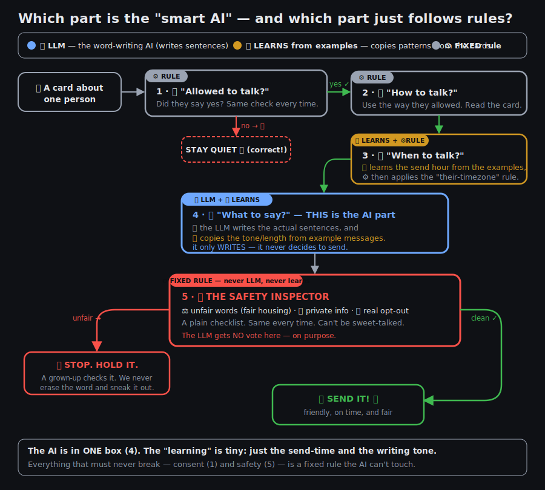

# Which part is the LLM, and which part "learns"? 🧠📈

A common question about this project: *where is the AI, exactly?* The honest answer
is that the "smart" part is small and boxed in on purpose. Here's the same checkpoint
game, color-coded.

## Three colors

🧠 **Blue = the LLM.** It lives in exactly **one** box — Checkpoint 4, "what to say."
That's the only place a language model runs. It writes the sentences and nothing
else. In the code that's `AnthropicComposer`; if there's no API key it falls back to
a simpler copy-from-examples writer (`OfflineComposer`), so even the *writing* doesn't
strictly need an LLM.

📈 **Yellow = learns from examples.** This is narrow, and worth being precise about,
because "learning" sounds bigger than it is here. Two spots:

- **Checkpoint 3 (when):** the send *hour* isn't hardcoded — it's fitted from the
  example cards. The samples send texts at 9am and emails at 10am, so it learns
  "text → morning, email → mid-morning." That's the `Scheduler` fitting from data.
- **Checkpoint 4 (tone):** the writer copies the *style and length* from a few example
  messages rather than being told "write three sentences." That's few-shot prompting.

That's the entire footprint of learning. It does **not** learn the consent rules, the
timezone rule, or the safety rules.

⚙️ **Grey / red = fixed rules.** Checkpoints 1, 2, and 5 never change and never involve
AI. "Did they say yes?" is the same check every time. And the **Safety Inspector (5)
is deliberately a plain checklist** — no LLM, no learning.

## Why the safety box is deliberately "dumb"

That last point is the most important design choice in the whole project. The
fair-housing screen is a *fixed rule* precisely because you can't let the creative
part police itself.

An LLM writing leasing copy will eventually produce steering language like "perfect
for young professionals" or "safe neighborhood" — not because it's broken, but because
decades of real estate ads in its training data taught it that this is what good copy
sounds like. A prompt instruction not to do that is a *request*, and requests fail
quietly under unusual inputs.

So the guarantee cannot live inside the model. The blue box **writes**; the red box
**decides if it's allowed out**; and the red box gives the blue box **no vote**. When
the inspector finds an unfair word, the message is *held for a human* — it is never
scrubbed and sent, because if the model reached for a steering phrase, the whole
message is suspect, not just the five words you'd delete.

## The one-line version

> The AI is **one box**. The learning is **two small habits** (send-time and writing
> tone). Everything that's legally dangerous — consent and fair housing — is **boring
> and fixed on purpose**, so the creative part can't talk its way past it.

See [`fairhousing.py`](fairhousing.py) for the screen, and [`README.md`](README.md)
for the full architecture.
