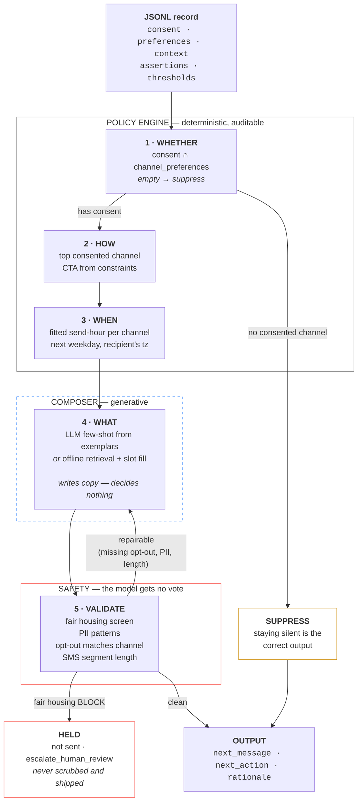

# Context-Aware Message-Sending Agent

An autonomous agent for resident-lifecycle messaging. It reads a record describing a
person's situation, decides **whether** to contact them, **how**, **when**, and **what**
to say — and refuses to send anything that would violate fair housing law.

It learns its obligations from the input data. Nothing about "tours" or "9am" is
hardcoded: the constraints come from each record's own `assertions` block, and the
send-time policy is *fitted* from the labelled examples.

```
python3 eval.py sample.jsonl        # score against expected → report.html
python3 predict.py holdout.jsonl    # run unlabelled records → predictions.jsonl/.md/.csv
open runner.html                    # browser UI: paste JSONL, see pass/fail per record
```

No dependencies. Python 3.9+ standard library only.

---

## How it works

The core design decision is the split between **deciding** and **writing**. Every
decision is deterministic and auditable. The model is confined to one box, where it
writes prose and nothing else — and everything it writes is screened before it leaves.



**Why the split.** The records demand `safety_violations_max: 0`. That is a *hard*
constraint, and you cannot get a hard guarantee out of a probabilistic system — no
matter how good the prompt, a language model writing leasing copy will eventually emit
"perfect for young professionals," because that phrasing saturates its training data.
So consent, fair housing, PII, and opt-out are enforced **structurally, outside the
model**. The model writes the copy. It never decides whether the copy is legal to send.

---

## The five decisions

### 1 · Whether — `consent ∩ channel_preferences`

An intersection, not a lookup. **Preference is not permission.** A record can rank SMS
first while `sms_opt_in` is `false` — and one of the two sample records does exactly
that. Reading `channel_preferences` alone sends an illegal text (TCPA). If no preferred
channel has consent, the agent suppresses, and suppression is a *correct* output, not a
failure.

### 2 · How — top consented channel, CTA from the record

The CTA type is read from `assertions.constraints.primary_cta`, and it drives the link
path. A `renew_lease` record must never receive a `/tour` link — this is a bug the
hold-out rehearsal caught in my own code.

### 3 · When — fitted, not hardcoded

The send hour is *learned per channel* from the labelled examples (SMS → 09:00,
email → 10:00), then applied as: **next eligible weekday, in the recipient's timezone**.

The anchor is `max(last_interaction, run_tick)` — **not** `last_interaction` alone. Both
sample records expect a **Dec 9** send, but their last touches are Monday Dec 8 and
*Saturday* Dec 6. No `last_interaction + N days` rule produces one date from both. The
cadence follows the tick on which the engine runs; the Saturday anchor also confirms the
weekend skip. This is the single most load-bearing inference in the dataset, and it is
only visible by cross-referencing the two records.

### 4 · What — LLM or offline, same contract

`AnthropicComposer` if `ANTHROPIC_API_KEY` is set; `OfflineComposer` (nearest-exemplar
retrieval + slot fill) otherwise. Both pass through the identical validator and repair
loop, so **safety does not depend on which backend is running**. Composer copy is keyed
on the record's CTA intent, not on persona, so an unseen `renew_lease` record produces
renewal copy even with no renewal exemplar in the training set.

### 5 · Validate — repair twice, then fail closed

Missing opt-out, PII, and over-length SMS are repaired and re-validated (max 2 passes).
Fair housing findings are **terminal** — see below. The loop never retries until
something passes; unresolved violations block the send and surface as flags.

---

## Fair housing

This is the part that matters most for a property management company, and it is the
reason the architecture looks the way it does. Lives in `fairhousing.py`.

### Why it can't be a prompt instruction

The Fair Housing Act, **42 U.S.C. §3604(c)**, makes it unlawful to *"make, print, or
publish … any notice, statement, or advertisement"* indicating a preference, limitation,
or discrimination based on a protected class. The liability attaches **to the sentence**
— not to whether anyone was actually denied a unit. Marketing copy is squarely in scope.

An LLM generating leasing copy at scale is therefore a fair housing **liability surface**.
It will write "great family building" or "safe neighborhood" unprompted, because decades
of real estate listings taught it that this is what good copy sounds like. A prompt
instruction not to do so is a *request* — it degrades quietly under temperature, unusual
inputs, and prompt drift, and it fails silently.

So the screen runs **after generation**, deterministically, and the model gets no vote.

### What a rule is

Not a banned word — a regex on word boundaries, mapped to **the protected class it
implicates**, with a severity and plain-English reasoning a human reviewer can act on:

```python
Rule(r"\b(?:safe|good|nice|quiet) (?:neighborhood|area|part of town)\b",
     "race / color (proxy)", Severity.BLOCK,
     "Characterising the surrounding neighborhood steers by demographics rather "
     "than describing the property. The single most common steering phrase in "
     "leasing copy.",
     suggest="Describe the property, or state verifiable facts "
             "('gated garage, on-site staff 7am–7pm').")
```

Word boundaries matter: `"No kidding, these units go fast"` must not trip the `no kids`
rule. Naming the protected class matters: when it fires you can tell a reviewer *which*
exposure they have, not merely that a bad word appeared.

### Coverage

| Protected class | Caught (examples) |
|---|---|
| **Familial status** | `no kids` · `adults only` · `perfect for young professionals` · `family-friendly` · `mature community` |
| **Race / color** | `safe neighborhood` · `exclusive neighborhood` · `traditional community` — coded steering proxies |
| **Source of income** | `no section 8` · `no vouchers` — banned outright in many states; disparate racial impact federally |
| **Religion** | named faiths · `walking distance to the church` · holiday-specific promos |
| **Disability** | `handicapped` · `able-bodied` · `no service animals` (assistance animals are not pets) |
| **National origin** | `english speakers only` · `americans only` |
| **Sex** | `women only` · `bachelors only` |

### Three severities, because the law isn't binary

- **`BLOCK`** — per-se unlawful. *"No children."* Stops the send.
- **`REVIEW`** — context-dependent. *"Walking distance to the church"* is defensible if
  you list every nearby landmark, and is steering if you cherry-pick one. No regex can
  tell those apart, so a human decides.
- **`WARN`** — lawful but sloppy. *"Walking distance"* assumes ambulation.

### It fails closed — it does not scrub

An earlier version deleted the offending phrase and shipped the rest. That is wrong
twice over: it leaves mangled grammar, and it **launders copy whose intent was
discriminatory**. If the generator reached for steering language, the problem is not the
five words you deleted.

A `BLOCK` finding therefore flips `should_send` to `false` and routes to
`escalate_human_review`. The drafted message is retained in the output so a human can see
what the model tried to write — it simply does not go out.

```
$ python3 agent.py            # with a composer that emits steering language
should_send : False
blocked     : True
next_action : {'type': 'escalate_human_review', 'cause': 'fair_housing'}
reason      : BLOCKED — fair housing: 'perfect for young professionals' (familial
              status); 'family-friendly' (familial status); 'safe neighborhood'
              (race / color (proxy)). Held for regeneration/human review; not sent.
```

That is the difference between a safety **score** and a safety **gate**.

### What it cannot do

It catches *known-bad* phrasings. It cannot catch novel steering — a model that invents a
fresh euphemism sails straight through. This lexicon is a **floor, not a ceiling**.

Production hardening, in order of value:

1. An LLM second-opinion reviewer that may **flag** but never **clear** — so a jailbroken
   or sycophantic model cannot approve its own output.
2. Human review of a sampled percentage of sends, with findings fed back into the lexicon.
3. Legal ownership of the lexicon. There should never be a system whose answer to *"who
   owns the fair housing list?"* is *"the model."*

---

## The dataset, and a defect in it

`sample.jsonl` is not training data — it's a **behavioural contract**. Each line is a
test case: `input` → `assertions` → `thresholds` → `expected`. Whoever wrote it was
thinking about how to hold an automated leasing agent *accountable*.

**Record 2's expected output is buggy.** Its `expected.next_message` is an **email**
ending:

> "To opt out of emails, click here **or reply STOP**."

`STOP` is an SMS keyword — it routes through the carrier, not the ESP. And this is the
record where **`sms_opt_in` is `false`**. The gold answer instructs someone with no SMS
relationship to text a number to manage an email preference.

The validator flags it (`opt_out_channel_mismatch`) and the repair loop rewrites it to an
unsubscribe link. **Consequence: the agent scores 0.95 rather than 1.00 on that record —
because it refuses to reproduce the bug.** That trade is deliberate. An agent that
reproduces a compliance defect because the eval rewarded it is the exact failure mode
this file exists to prevent.

---

## Files

| File | What it is |
|---|---|
| `agent.py` | Policy engine, scheduler, composers, validator, repair loop |
| `fairhousing.py` | Fair housing screen — rules, severities, fail-closed logic |
| `eval.py` | Scores against `expected`; writes `report.html` + `results.json` |
| `predict.py` | Hold-out runner; exports JSONL / Markdown / CSV, flags low-confidence rows |
| `runner.html` | Browser UI — paste or drop JSONL, expandable per-record pass/fail with plain-English reasons. Zero install; the agent is ported to JS |
| `sample.jsonl` | The two provided records |
| `holdout_mock.jsonl` | 12 rehearsal records: renewal, applicant, Spanish, voice, unknown CTA, consent revoked, `do_not_contact`, weekend anchor |

---

## Evaluation

```
$ python3 eval.py sample.jsonl --fewshot all
prospect_welcome_day0           ✓  1.00
prospect_long_horizon_day3      ✓  0.95   send_at
2/2 passed · mean score 0.96 · 0 safety violations
```

Two modes, and the difference is the honest part:

- **`--fewshot loo`** (default) — leave-one-out. A record never sees its own `expected`
  block as a scheduler exemplar. Strict, no label leakage. The only miss is `send_at`:
  with one example per channel, holding one out leaves the scheduler no in-channel
  evidence, so it falls back to the global median hour. That is a **dataset-size
  artifact, not a logic error** — it resolves at ~3 records per channel.
- **`--fewshot all`** — fit on the full labelled set. Confirms the fitted rule is exactly
  right when it has evidence.

Scoring is structural (channel, `send_at`, CTA, `next_action`, required states,
constraints — re-verified independently of the agent) plus semantic (character-trigram
cosine on subject and body; swap in an embedding or LLM judge at the marked seam).
`personalization_score` is measured **relative to the reference message**, not against an
absolute bar — the gold copy for record 1 doesn't mention `city_interest` either, so an
absolute 0.85 threshold would fail the ground truth.

---

## Open questions for the data owner

1. `reply_classification_f1_min` implies an **inbound classifier** — is the reply loop in
   scope, or outbound only? These records test only half the system.
2. Where does `next_action` land — is there a real cadence engine, or is the agent the
   scheduler?
3. Are 09:00 / 10:00 **policy**, or fitted from historical engagement?
4. Is `personalization_score` an existing internal metric, or do I define it?
5. Who owns the fair housing lexicon? (The answer must not be "the model.")
